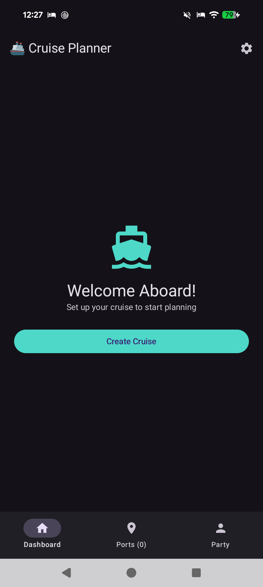
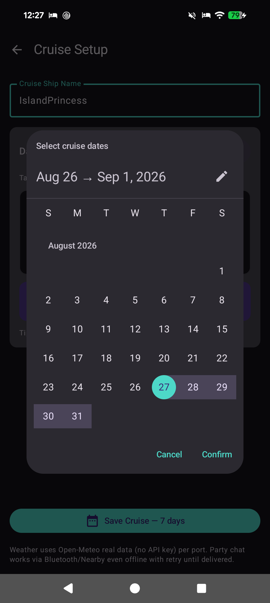
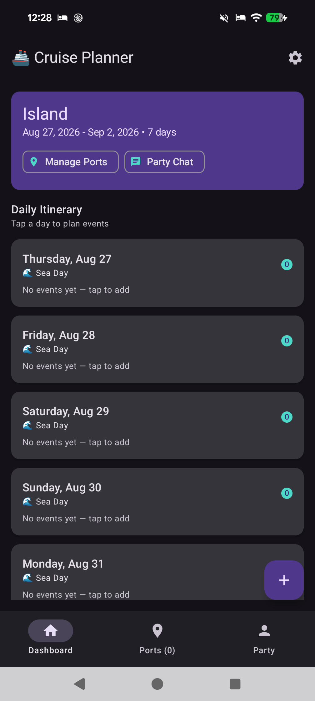
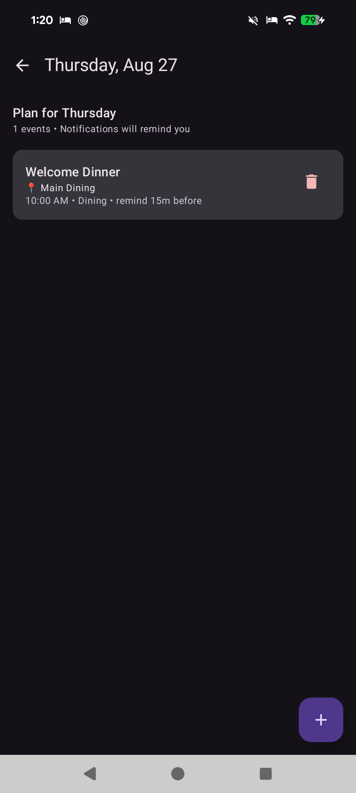
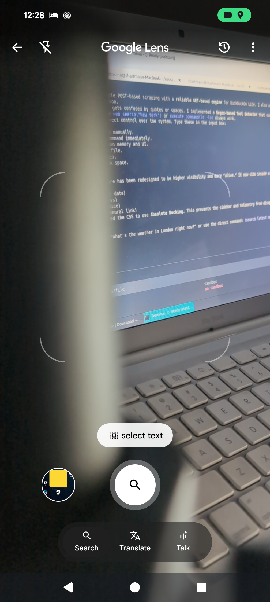
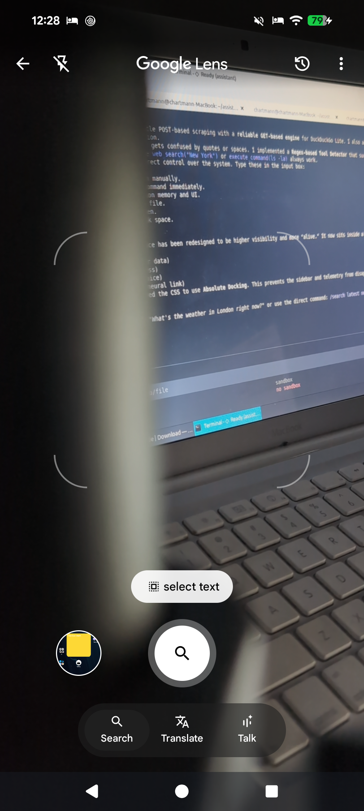

# 🚢 Cruise Planner — Offline-First Cruise Companion

[](#)
[](#)
[](#)
[](LICENSE)
[](#)
[](https://cruise-app-2026.web.app)
[](https://cruise-app-2026.web.app/privacy)

**Plan your entire cruise without Wi-Fi.**

Cruise Planner is an offline-first Android app for cruise passengers. Create your voyage, add real port stops, plan each sea day, get live weather (no API key), receive local reminders, and chat with your party over **Bluetooth / BLE / Wi-Fi Direct** — even when the ship has no internet.

> **🌐 Website:** [https://cruise-app-2026.web.app](https://cruise-app-2026.web.app) · **📄 Privacy Policy:** [https://cruise-app-2026.web.app/privacy](https://cruise-app-2026.web.app/privacy) · **📦 Package:** `com.charles.cruiseapp`

No mock data. No cloud sync for your plans. Your cruises, ports, events and chats stay on your device.

---

## ✨ Why Cruise Planner?

* **Built for the ship, not the shore.** Room is the source of truth. Weather is cached for 3 hours, messages queue until a peer is in range.
* **No accounts, no roaming surprises.** Party identity via QR code — scan, don't type. Chat is encrypted P2P via Google Nearby Connections (`P2P_CLUSTER`).
* **Private by design.** No server sees your itinerary. Crash reports are anonymized.

---

## 📸 Screenshots — Pixel 8 Pro

| Welcome | Cruise Setup | Calendar |
|---|---|---|
|  |  |  |

| Dashboard | Port List | Weather |
|---|---|---|
|  |  |  |

| Day Detail | Party Chat | My QR |
|---|---|---|
|  |  |  |

> Fresh install shows **Welcome Aboard → Create Cruise** only. Screenshots use real demo data injected via a local Debug activity — the app ships with an empty database.

---

## 🎯 Features

### 🗓️ Cruise & Daily Planner
* Create a cruise by ship name + calendar date range. Duration is auto-calculated and every day is generated automatically.
* Per-day view with sea/port badges, add/edit/delete events (title, time, location, category, reminder 1–60 min).

### 📍 Real Port Stops
* Search any city via **Open-Meteo Geocoding** (free, no API key) — lat/lon auto-filled, stored locally.
* Arrival/departure dates, country and order preserved.

### 🌤️ Weather — Free, No API Key
* `api.open-meteo.com/v1/forecast` + geocoding — 7-day daily + current, mapped to emoji, cached 3 h for offline use.
* Pull once on port Wi-Fi, view on sea days with no signal. Attribution CC BY 4.0.

### 🔔 Local Notifications
* Exact alarms via `AlarmManager.setExactAndAllowWhileIdle` on a high-importance channel, rescheduled after reboot.
* Supports Android 13+ `POST_NOTIFICATIONS` and `SCHEDULE_EXACT_ALARM`.

### 💬 Offline Party Chat — The Headliner
* **Transport:** Google Play Services Nearby Connections `P2P_CLUSTER` → Bluetooth + BLE + Wi-Fi Direct, encrypted, no internet, ~100 m per hop.
* **QR identity:** Each member gets a persistent UUID. **My QR** shows it via ZXing; **Scan** via Camera adds them instantly — no typing, no mix-ups.
* **Broadcast or private:** Choose **To: Everyone** or a specific shipmate.
* **Reliable:** `PENDING → SENT → DELIVERED → READ` with receipts, retry every 5 s until delivered, even after reboot. Blue ticks for read.

### 📆 Calendar
* Material 3 `DatePickerDialog` + `DateRangePicker` with fine −1 d/+1 d nudge, midnight-normalized.

---

## 🚀 How It Works

1. **Create your cruise** — Name your ship, pick start/end on the calendar. We generate every day.
2. **Add ports & plans** — Search “Nassau” → Use → Add Port. Tap any day to add “Welcome Dinner 10:00 Main Dining”.
3. **Stay in sync offline** — Share your QR with your party. Chat over Nearby — no ship Wi-Fi needed. Weather pulls once, then cached.

---

## 🔒 Privacy at a Glance

* **On-device only:** Cruises, ports, events, messages → Room DB `cruise_db` on your phone. We run no server.
* **Firebase Crashlytics & Performance:** Anonymized crash traces + speed traces (enabled). User ID is a random UUID, not your email. See [Privacy Policy](public/privacy.html) for full details and opt-out.
* **Open-Meteo:** Weather queries go directly from your device to Open-Meteo (lat/lon + IP per their policy). Cached locally.
* **Nearby:** P2P encrypted, no relay. Your QR contains only your display name + random code.

Full policy: [`/privacy`](https://cruise-app-2026.web.app/privacy) — also shipped as `public/privacy.html` for Firebase Hosting.

---

## 📲 Download

* **APK:** [GitHub Releases](https://github.com/chartmann1590/cruise-app/releases) — v1.0, ~23 MB, Android 8+ (minSdk 26, targetSdk 35).
* **🌐 Website:** [https://cruise-app-2026.web.app](https://cruise-app-2026.web.app)
* **📄 Privacy Policy:** [https://cruise-app-2026.web.app/privacy](https://cruise-app-2026.web.app/privacy)

---

## 🛠️ Build from Source

> Requires your own Firebase project. The real `google-services.json` is **not** committed (see `.gitignore`). A template is provided.

```bash
# 1. Clone
git clone https://github.com/chartmann1590/cruise-app.git
cd cruise-app

# 2. Firebase setup
# Create a Firebase project, add an Android app with package com.charles.cruiseapp,
# download google-services.json and place it at:
#   app/google-services.json
# Or copy the template:
cp app/google-services.json.example app/google-services.json
# then fill in YOUR_PROJECT_ID / YOUR_API_KEY

# 3. Build
./gradlew assembleDebug

# 4. Install (generic device — replace with your device)
adb install -r app/build/outputs/apk/debug/app-debug.apk
adb shell am start -n com.charles.cruiseapp/.MainActivity
```

<details>
<summary>Tech stack</summary>

* **Language/UI:** Kotlin 1.9.22, Compose 1.5.8 (BOM 2024.10.00), Material 3, Navigation Compose 2.8.4, AGP 8.3.2
* **Data:** Room 2.6.1, DataStore/SharedPreferences, `fallbackToDestructiveMigration()`
* **Network:** Retrofit 2.11, OkHttp 4.12, kotlinx.serialization 1.6.3, Open-Meteo (no key)
* **Nearby/QR:** Play Services Nearby 19.3, ZXing 3.5.3 + zxing-android-embedded 4.3.0
* **Firebase:** BOM 32.7.4, Analytics + Crashlytics + Performance (restricted API key)
* **Permissions:** INTERNET, POST_NOTIFICATIONS, SCHEDULE_EXACT_ALARM, RECEIVE_BOOT_COMPLETED, BLUETOOTH_SCAN/ADVERTISE/CONNECT, NEARBY_WIFI_DEVICES, CAMERA

Verify no secrets before pushing:

```bash
git diff --cached --stat
# should NOT show app/google-services.json
```

</details>

<details>
<summary>Project structure</summary>

```
com.charles.cruiseapp
 ├─ CruiseApplication (Room + WeatherRepository + NotificationChannels)
 ├─ data/local (Room v3: Cruise, PortStop, PlannedEvent, PartyMember, Message, WeatherCache)
 ├─ data/remote (OpenMeteoApi / GeocodingApi via Retrofit)
 ├─ data/nearby (NearbyManager, WireMessage, retry)
 ├─ notifications (AlarmManager + Receivers)
 ├─ ui/theme, navigation, components/WeatherCard, screens/*
 └─ util (DateUtils, WmoCodes, QrUtils, FirebaseUtils)
```

</details>

---

## 🤝 Contributing

Issues and PRs welcome! Please:

1. Open an issue describing the change.
2. Fork → branch → ` ./gradlew assembleDebug` should pass.
3. Do **not** commit `app/google-services.json`, keystores (`*.jks`, `*.keystore`) or `.env` files.

See [SECURITY.md](SECURITY.md) for reporting vulnerabilities.

---

## 📄 License

MIT — see [LICENSE](LICENSE). Weather data © Open-Meteo CC BY 4.0. Icons via Material, fonts Inter + Plus Jakarta Sans.

Firebase project `cruise-app-2026` and hosting `cruise-app-2026.web.app` are for the official build only — forkers should use their own Firebase project.

---

## 📮 Contact

* **🌐 Website:** [https://cruise-app-2026.web.app](https://cruise-app-2026.web.app)
* **📄 Privacy Policy:** [https://cruise-app-2026.web.app/privacy](https://cruise-app-2026.web.app/privacy)
* **GitHub Issues:** [chartmann1590/cruise-app/issues](https://github.com/chartmann1590/cruise-app/issues)

© 2026 Cruise Planner • `com.charles.cruiseapp` • Built offline, for offline.
